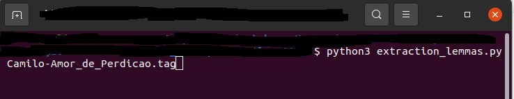
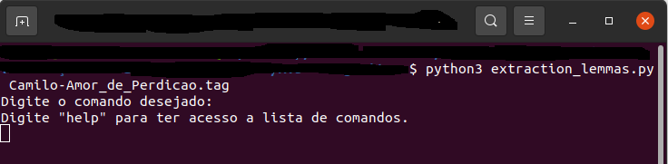
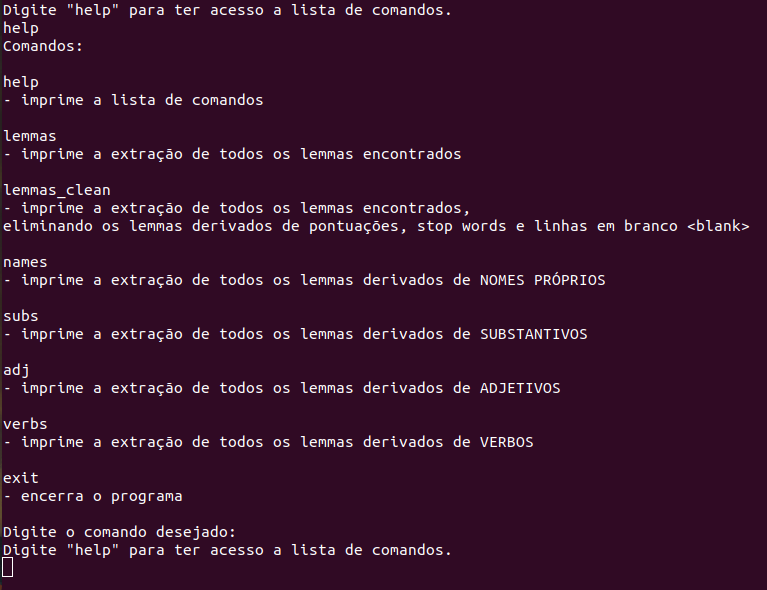
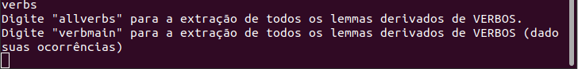
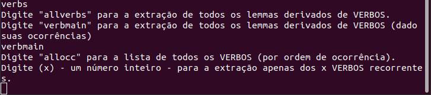
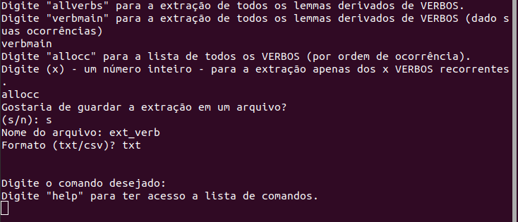
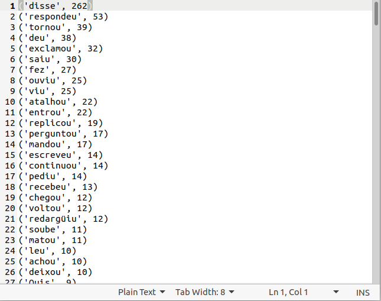

## Linguakit 

### Instalando o Linguakit

escolher uma pasta onde o linguakit possa ficar (Exemplo: `Documents`)

- git clone  https://github.com/JJoao/Linguakit Documents
   
#### também é possível instalar o linguakit via github-desktop

```
 [instalar repo]
   →[a partir de URL]
      → https://github.com/JJoao/Linguakit
```
#### ou

- gh repo clone jjoao/linguakit

## Linguakit Tagger PT

### Convertendo um arquivo .txt para .tag

-- execute no terminal o comando `linguakit tagger pt` input .txt > output.tag

```
linguakit tagger pt Camilo-Amor_de_Perdicao.txt > Camilo-Amor_de_Perdicao.tag

```
-- o nome do output é arbitrário 

## Script .py

### Executando o script após a conversão do arquivo .txt > .tag

-- execute o script em python no terminal adicionando o arquivo .tag como input












-- caso opte por não guardar o output em um arquivo, o mesmo executará no próprio terminal




